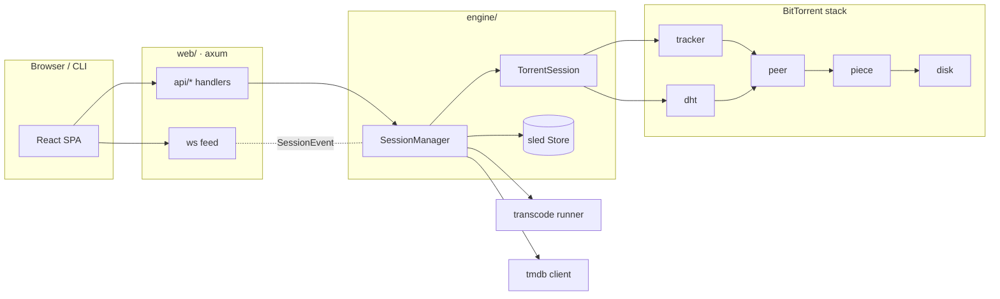

# Workflow sequence diagrams

Sequence diagrams for each major MovieHouse workflow. Diagrams are [Mermaid](https://mermaid.js.org/) and render natively on GitHub. File/line anchors point at the source that implements each step.

| Diagram | Workflow |
|---------|----------|
| [download-torrent.md](download-torrent.md) | Add and run a download from a `.torrent` file (web API → engine → completion → library) |
| [download-magnet.md](download-magnet.md) | Magnet link: BEP 9/10 metadata exchange before the normal download |
| [peer-piece-exchange.md](peer-piece-exchange.md) | Peer wire protocol and the pipelined request/piece download loop |
| [dht-discovery.md](dht-discovery.md) | DHT bootstrap and iterative `get_peers` lookup for an infohash |
| [transcoding.md](transcoding.md) | Transcode job lifecycle: enqueue → ffprobe → ffmpeg → progress → library |
| [library-tmdb.md](library-tmdb.md) | Folder scan/import and TMDB metadata enrichment |
| [streaming-and-progress.md](streaming-and-progress.md) | HTTP range streaming and the WebSocket progress feed |

## How the pieces fit together

Regenerate/extend these by tracing the code paths under `src/`; keep the anchors current when the code moves.
