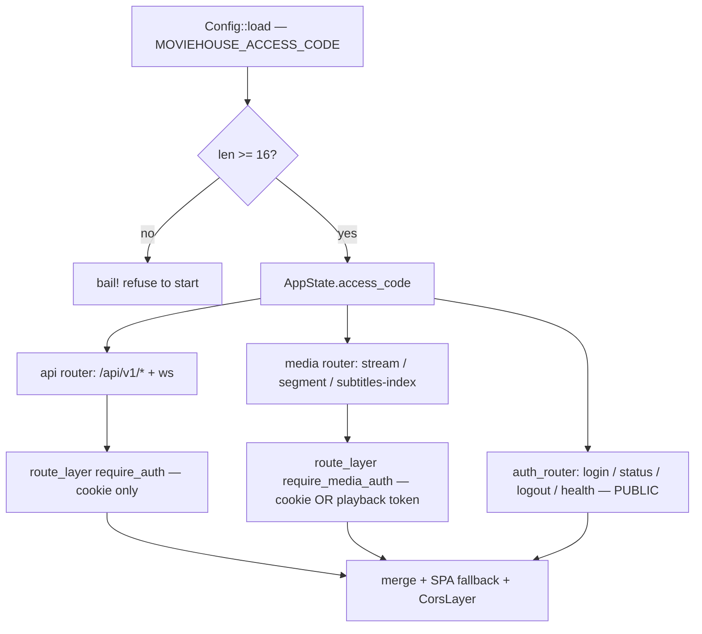
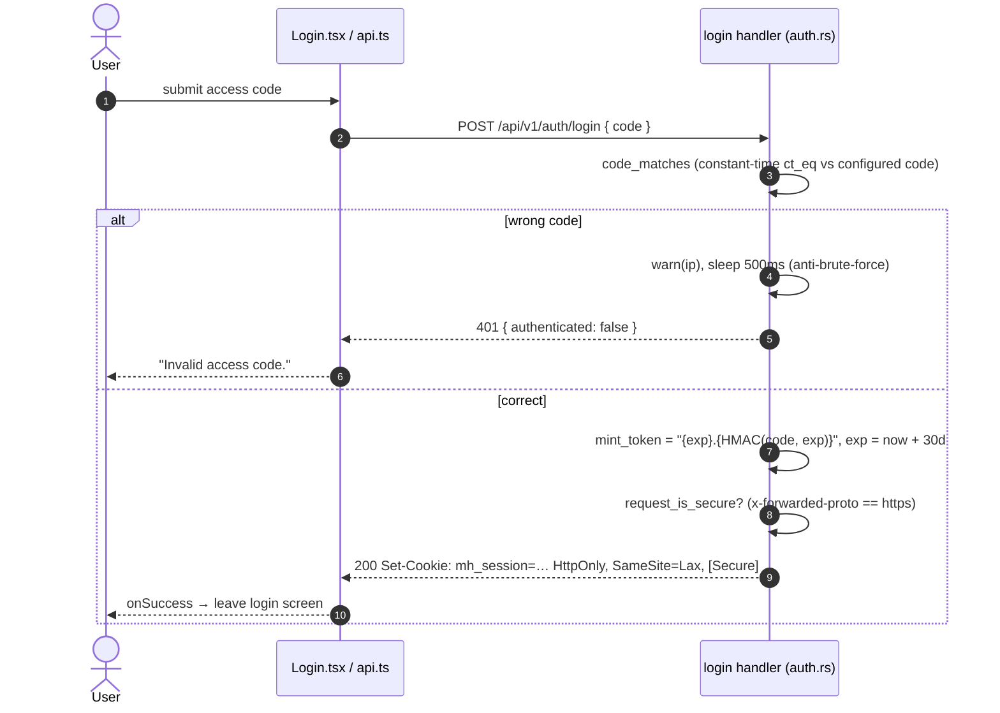
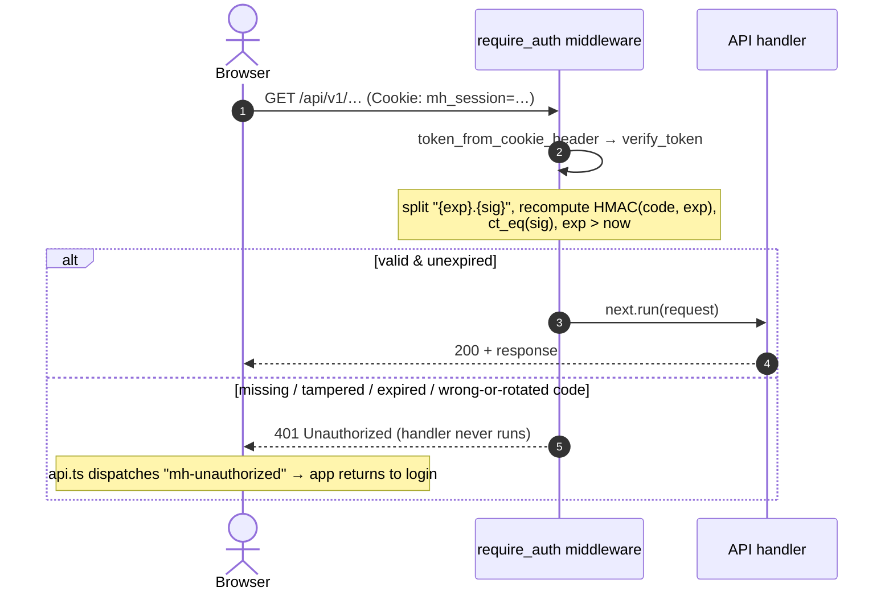
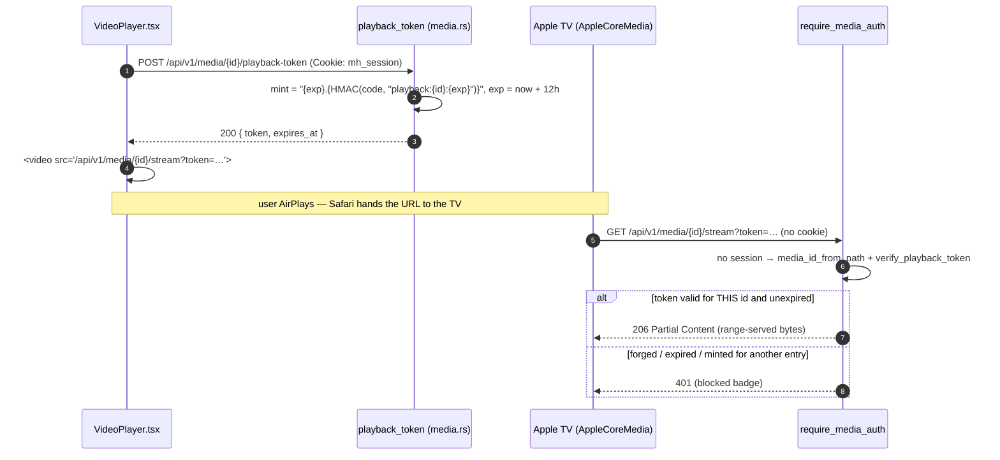

# Access-code authentication

A single access code gates the whole app. Login mints a stateless HMAC-SHA256 session cookie; a middleware verifies it on every `/api/v1/*` route except the public auth/health endpoints. **The access code is both the login secret and the HMAC key** (`src/web/auth.rs`), so rotating `MOVIEHOUSE_ACCESS_CODE` invalidates every session at once.

## Startup & router wiring

At boot, `cmd_serve` refuses to start if the code is shorter than 16 chars, then wraps the API router with the auth middleware while leaving the auth router public.

## (A) Login

## (B) Guarded request

## (C) Playback token — AirPlay / Chromecast

An AirPlay receiver is a **separate device**: Safari hands the Apple TV the media URL and the TV fetches it itself, with no access to the browser's cookie jar. Under the cookie-only guard it got `401` and showed a blocked badge instead of a play button. `SameSite=None` cannot help — this is a different device, not a cross-site context.

- **Scope:** the signed message is `"playback:{media_id}:{exp}"`. A session token signs the bare `exp`, so the two spaces are **domain-separated** — neither token type verifies as the other, and a token is useless for any entry but the one it names.
- **Reach:** `require_media_auth` guards only `/stream`, `/segment/{filename}`, and `/subtitles/{index}`. `PUT /progress`, subtitle upload, and the rest of the API stay cookie-only, so a leaked playback URL reads one title and can change nothing.
- **HLS:** `stream_media` copies the caller's token into the segment URLs it writes into the `.m3u8`, or the receiver would `401` on every segment. Only a well-formed `{digits}.{hex}` token is echoed back.

## Notes

- **Public routes:** `POST /auth/login`, `GET /auth/status`, `POST /auth/logout`, `GET /health`, and the SPA static fallback. Everything else under `/api/v1/*` is guarded.
- **Cookie:** `mh_session`, `HttpOnly`, `SameSite=Lax`, `Path=/`, `Max-Age=2592000` (30 days); `Secure` added only over HTTPS. The signed message is just the `exp` timestamp.
- **Fail-closed:** if HMAC key init ever fails, `sign` returns `""`, which never verifies. Both the login compare and the signature compare use `subtle::ConstantTimeEq`.
- **Stateless:** no server-side session store, so individual sessions can't be revoked — only rotating the access code (the HMAC key) invalidates all of them. CORS allows any origin but sets no `allow_credentials`, limiting cross-origin CSRF against the cookie.
- Source: `src/web/auth.rs`, `src/web/server.rs`, `src/main.rs` (`cmd_serve`), `frontend/src/components/Login.tsx`, `frontend/src/lib/api.ts`.
