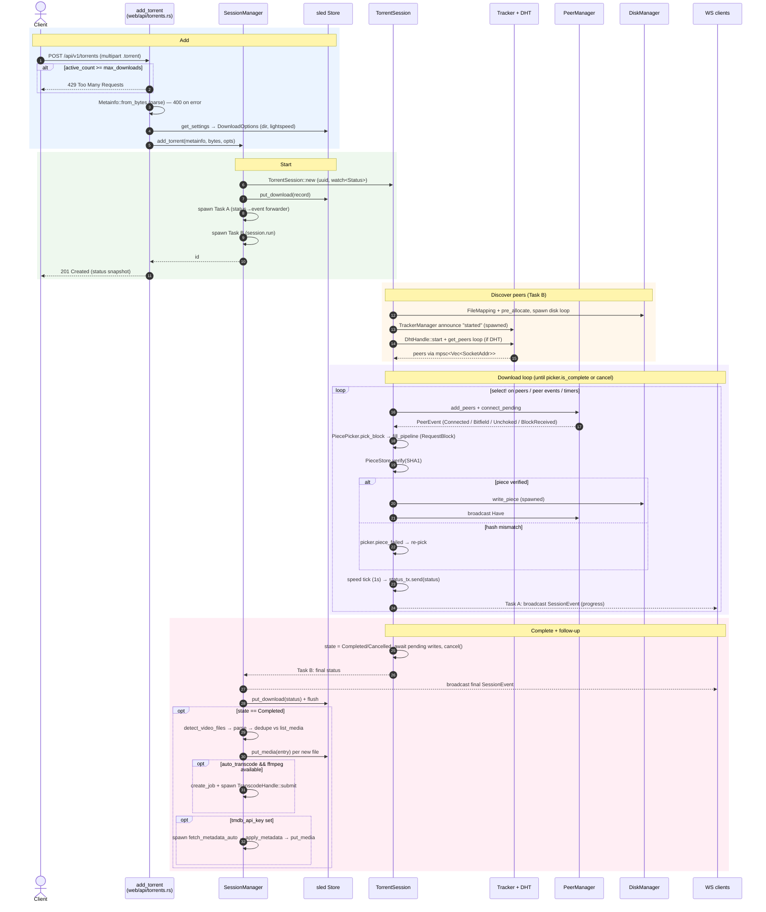

# Download from a `.torrent` file

Adding a torrent via the web API, running it to completion, and the post-completion library/transcode/metadata follow-up.

Entry point: `add_torrent` (`src/web/api/torrents.rs`). The engine is driven by `SessionManager` (`src/engine/manager.rs`) and one `TorrentSession` per download (`src/engine/session.rs`), persisted in the sled `Store` (`src/engine/store.rs`).

## Notes

- **Channels:** per-session `watch<SessionStatus>` (session → forwarder); `broadcast<SessionEvent>` cap 256 (forwarder → all WS clients); `mpsc<Vec<SocketAddr>>` cap 64 (tracker + DHT → session); `mpsc<(SocketAddr, PeerEvent)>` cap 512 (peers → session).
- **The `.torrent` path is synchronous** into `add_torrent`; the magnet path in the same handler is a two-phase async variant — see [download-magnet.md](download-magnet.md).
- **Persistence cadence:** the forwarder task persists status to the store roughly every 5s and on `Completed`/`Error`.
- Source: `src/web/api/torrents.rs`, `src/engine/manager.rs`, `src/engine/session.rs`, `src/engine/store.rs`, `src/web/ws.rs`.
