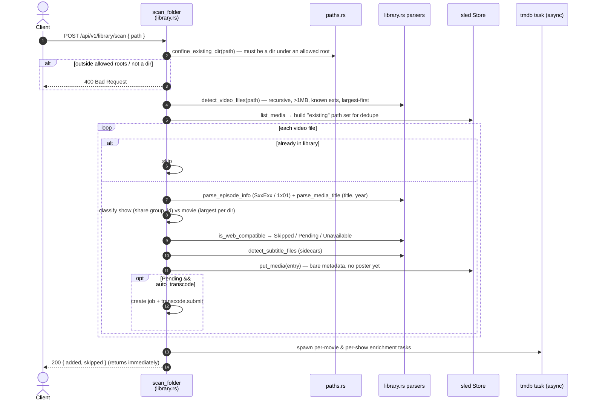

# Library scan & TMDB enrichment

Two related workflows: (A) scanning a folder to import media files into the library, and (B) enriching entries with TMDB metadata (posters, cast, director, ratings, per-episode synopses). Handlers live in `src/web/api/library.rs`; parsing/classification in `src/engine/library.rs`; the TMDB client in `src/tmdb.rs`.

> TMDB auth is via the `api_key` query parameter (`settings.tmdb_api_key`) on every request — there is no v4 Bearer read-token path in the code.

## (A) Folder scan / import



## (B) TMDB enrichment

```mermaid
sequenceDiagram
    autonumber
    actor Client
    participant API as refresh handlers<br/>(library.rs)
    participant Store as sled Store
    participant T as tmdb.rs (get_json)
    participant API3 as TMDB HTTP API

    Client->>API: POST /library/:id/refresh (or /groups/:id/refresh-metadata)
    API->>Store: get_media (404 if missing) + get_settings
    alt tmdb_api_key empty
        API-->>Client: 400 TMDB API key not configured
    end
    Note over API: no "already enriched" guard — refresh always re-fetches & overwrites
    API->>API: parse title/year; is_show = show_name.is_some()
    API->>T: fetch_metadata_auto(key, title, year, is_show)
    alt movie
        T->>API3: GET /search/movie → first result
        T->>API3: GET /movie/{id}/credits
    else show
        T->>API3: GET /search/tv → first result
        T->>API3: GET /tv/{id}/credits
    end
    alt no match
        T-->>API: None
    end
    T-->>API: poster, overview, rating, cast (top 5), director, tmdb_id
    API->>Store: apply_metadata(entry) + put_media
    opt show, per season (group refresh)
        API->>T: fetch_season_episodes(tmdb_id, season)
        T->>API3: GET /tv/{id}/season/{n}
        API->>Store: set episode_title + overview per episode → put_media
    end
    API-->>Client: 202 Accepted (refreshing)

    Client->>API: GET /api/v1/library (poll) / /library/groups
    API->>Store: list_media → JSON (now enriched)
```

## Notes

- **`get_json` client:** 15s timeout, up to 4 attempts with linear backoff on transport errors / 429 / 5xx; 4xx treated as a miss; URLs are never logged (they contain the API key).
- **Movies vs shows:** movies get `group_id = None` and `search/movie` enrichment; shows share a `group_id`, use `search/tv`, and additionally get per-season/per-episode synopses. `GET /library/groups` buckets by `group_id`, sorts episodes by (season, episode), and computes season/episode counts.
- **Async by design:** scan and refresh return immediately; enrichment runs in spawned tasks, and the client picks up results via the 3s library poll — see [streaming-and-progress.md](streaming-and-progress.md).
- **Path safety:** only the scan/folder-browser/config endpoints take a caller-supplied path, and those go through `paths.rs` (`confine_existing_dir` / `allowed_roots`).
- Source: `src/web/api/library.rs`, `src/engine/library.rs`, `src/tmdb.rs`, `src/engine/store.rs`, `src/web/api/paths.rs`.
