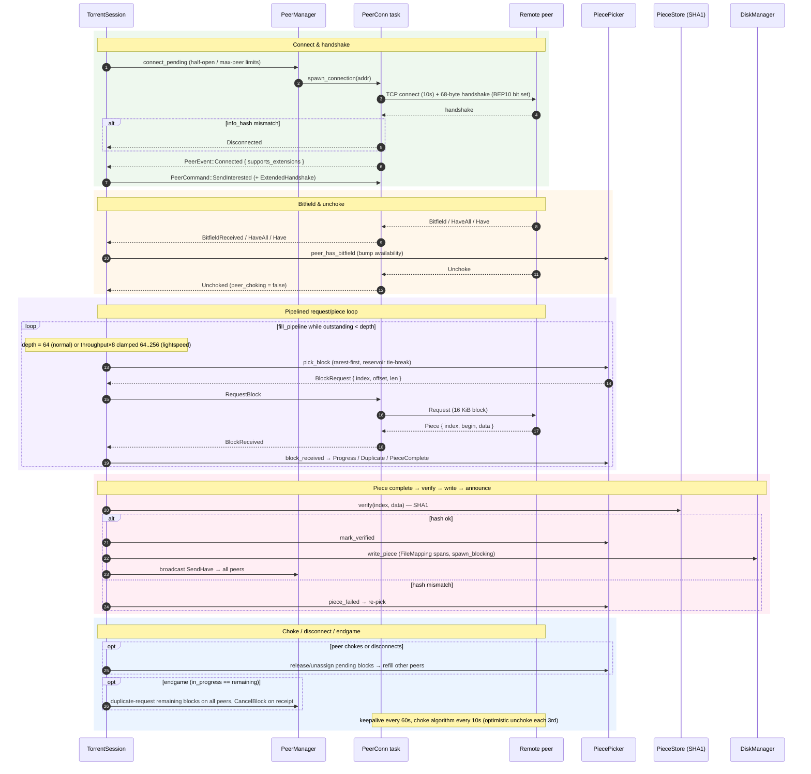

# Peer wire protocol & pipelined piece download

How a single peer connection goes from TCP connect to downloading verified pieces. One tokio task per peer (`run_peer_connection`, `src/peer/connection.rs`) multiplexes socket reads, commands, and keepalive with a single `select!` loop — there are no separate read/write tasks. The `TorrentSession` loop (`src/engine/session.rs`) owns the `PiecePicker` and drives requests.

## Notes

- **Channels:** `mpsc<(SocketAddr, PeerEvent)>` cap 512 (all peers → session, single receiver); per-peer `mpsc<PeerCommand>` cap 512 (session → peer, `try_send`); `mpsc<DiskCommand>` cap 64 with per-request `oneshot` reply.
- **Picker strategy:** starts RandomFirst, flips to RarestFirst after the first verified piece; endgame mode fans out duplicate requests to finish the tail quickly.
- **Disk writes** map each piece to per-file byte spans (`FileMapping::piece_spans`) and run on `spawn_blocking`; `sync_all` is skipped in lightspeed mode. Outstanding writes are awaited at shutdown.
- Source: `src/peer/{handshake,connection,manager,message,codec}.rs`, `src/piece/{picker,store,bitfield}.rs`, `src/disk/{io,mapping}.rs`, `src/engine/session.rs`.
