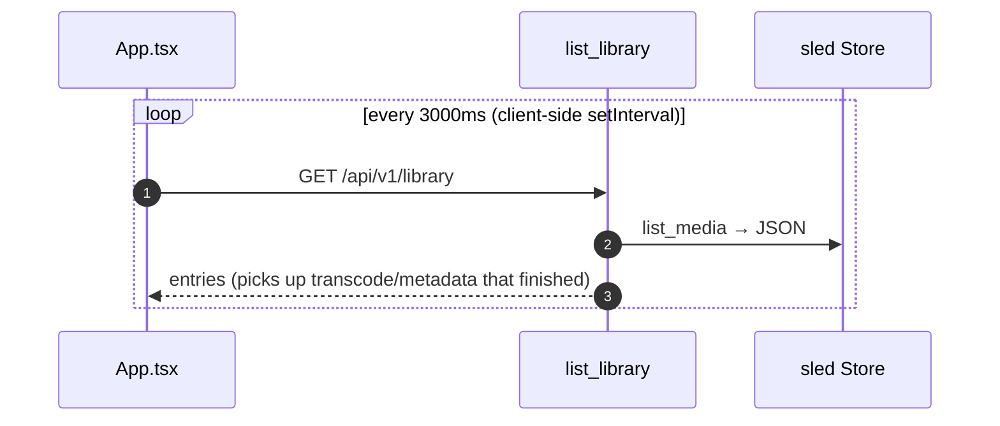

# Video streaming & real-time progress

Two client-facing runtime workflows: (A) serving video with HTTP range requests for in-browser seeking, and (B) the WebSocket feed that pushes download progress. Note the split: **downloads are pushed over WebSocket; library/transcode state is pulled by a 3-second client-side poll.**

## (A) Video streaming with range requests

`stream_media` (`src/web/api/media.rs`) picks the best playable file for a media id and serves it with `206 Partial Content` when the browser sends a `Range` header.

```mermaid
sequenceDiagram
    autonumber
    participant V as Browser &lt;video&gt;
    participant H as stream_media (media.rs)
    participant Store as sled Store
    participant FS as filesystem

    V->>H: GET /api/v1/media/{id}/stream [Range: bytes=start-]
    H->>Store: get_media(id)
    alt no media / no playable file
        H-->>V: 404
    end
    H->>H: pick path — versions[h264] → versions[hevc] → Ready output → original (Skipped)
    alt file is .m3u8 (HLS)
        H->>FS: read playlist; rewrite segment URLs → /media/{id}/segment/{name}
        H-->>V: 200 application/vnd.apple.mpegurl
        Note over V,H: browser then fetches each .ts via stream_segment<br/>(inline ../ /\ traversal guard)
    else regular file
        H->>FS: File::open + metadata (len)
        alt Range header present
            H->>H: parse start-end; clamp end to len-1
            alt start >= len
                H-->>V: 416 Range Not Satisfiable
            end
            H->>FS: seek(start) + take(content_length)
            H-->>V: 206 Partial Content<br/>Content-Range, Accept-Ranges: bytes
        else no Range
            H-->>V: 200 OK full body, Accept-Ranges: bytes
        end
    end
```

## (B) WebSocket download progress

`ws_handler` (`src/web/ws.rs`) sends a snapshot on connect, then forwards every `SessionEvent` from the `SessionManager` broadcast channel.

```mermaid
sequenceDiagram
    autonumber
    participant UI as useWebSocket.ts
    participant WS as handle_socket (ws.rs)
    participant Mgr as SessionManager
    participant Fwd as per-session forwarder

    UI->>WS: connect ws(s)://…/api/v1/ws
    WS->>Mgr: list() (active + persisted history)
    WS-->>UI: { type: snapshot, torrents: [...] }
    WS->>Mgr: subscribe() → broadcast::Receiver&lt;SessionEvent&gt; (cap 256)
    Note over Fwd,Mgr: producer side — session watch&lt;Status&gt; change<br/>→ event_tx.send(SessionEvent); also register/fail_magnet + final
    loop rx.recv()
        Mgr-->>WS: SessionEvent { id, status }
        WS-->>UI: { type: update, id, status } → torrents.set(id, status)
        alt send fails / client disconnect
            WS->>WS: break (task ends)
        else Lagged (slow consumer)
            WS->>WS: skip, continue
        end
    end
    opt socket closes
        UI->>UI: reconnect after 2000ms
    end
```

## (C) Library polling (separate from WebSocket)



## Notes

- **Why two mechanisms:** WebSocket carries fast-changing download progress (push); the 3s poll picks up library changes — transcode completion, TMDB enrichment — that finish after a download and have no push channel. See [transcoding.md](transcoding.md) and [library-tmdb.md](library-tmdb.md).
- **Streaming path safety:** the served path is chosen from server-controlled `MediaEntry` fields, not user input — only the opaque `Uuid` is caller-supplied. `stream_segment` adds an inline `..`/`/`/`\` traversal guard. (The `paths.rs` confinement applies to config endpoints that take a directory, not to byte-serving here.)
- **`SessionEvent`** = `{ id: Uuid, status: SessionStatus }`; `SessionStatus` carries progress, bytes, speed, peer count, and state.
- Source: `src/web/api/media.rs`, `src/web/ws.rs`, `src/engine/manager.rs`, `src/engine/types.rs`, `frontend/src/hooks/useWebSocket.ts`, `frontend/src/App.tsx`.
