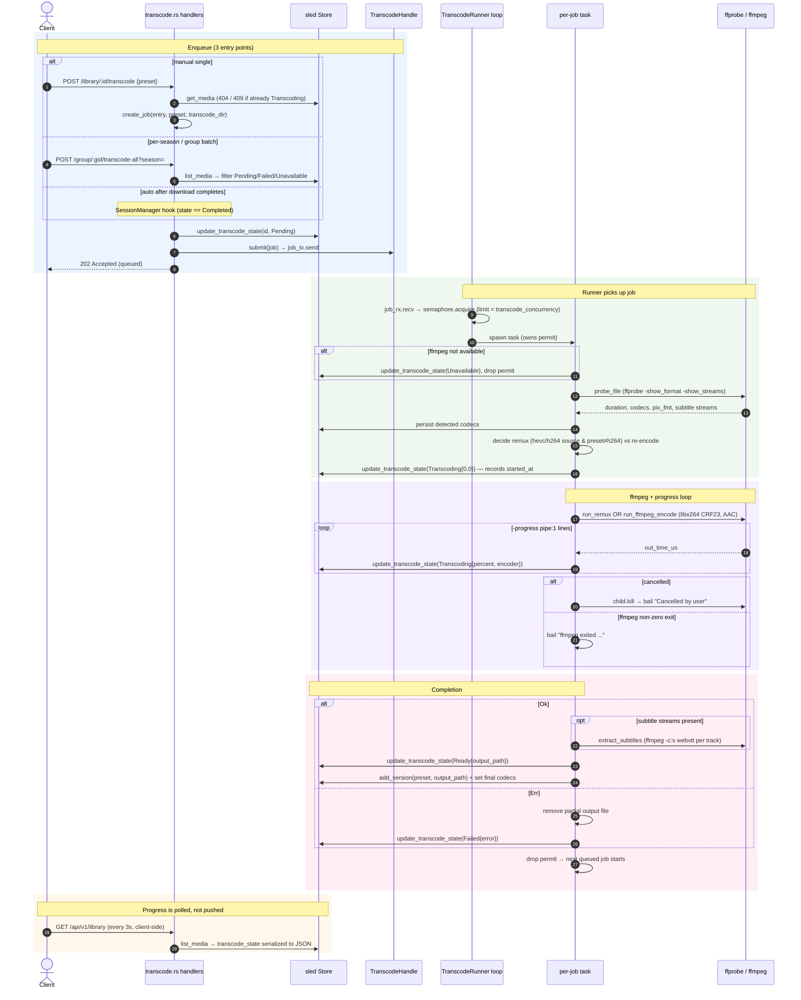

# Transcoding

Transcode jobs are queued into an `mpsc` channel and run by `TranscodeRunner` (`src/transcode/runner.rs`) under a semaphore (default 2 concurrent). Each job probes the input with `ffprobe`, chooses a preset (HEVC remux vs H.264 re-encode), spawns `ffmpeg`, and streams progress into the sled `Store`. There is **no** push channel for transcode progress — the frontend polls `GET /api/v1/library`.

## Notes

- **Presets:** `hevc` remuxes MKV→MP4 (hvc1 tag, no re-encode, fast); `h264` re-encodes with libx264 for universal compatibility. Remux requires an h264/hevc source and a non-`h264` preset.
- **Cancellation:** each running job registers a `CancellationToken` in a `DashMap` keyed by media id. Per-job cancel, per-season/group stop, and shutdown (`cancel_all`) all kill the underlying `ffmpeg` child.
- **Crash recovery:** progress is persisted every tick, so a crash leaves entries stuck in `Transcoding`. On startup `recover_stuck_transcodes` resets those to `Pending` and deletes partial outputs. The store also ignores invalid state transitions, so a cancel racing completion can't corrupt state.
- **`-1.0`** is a progress sentinel meaning duration was unknown (probe failed).
- Source: `src/transcode/{runner,job,ffmpeg,presets,probe}.rs`, `src/web/api/transcode.rs`, `src/engine/manager.rs`, `src/engine/store.rs`.
